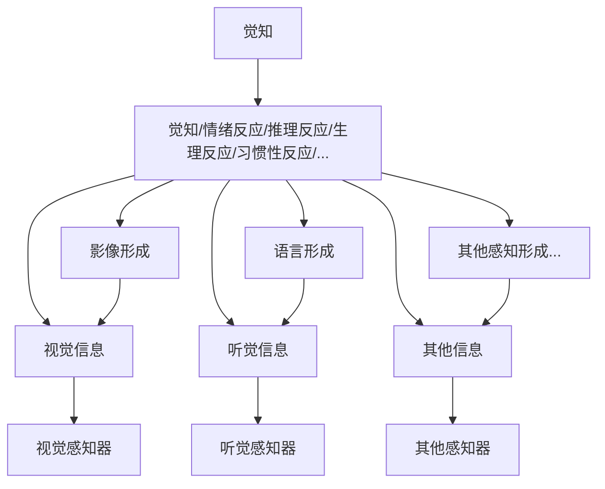

在这讲之前，已经做了很多铺垫。包括《从“我”说起》，《万物集成定理》，《人类自我中心论》以及《构建与拆分》。

现在可以用这些的铺垫，来进一步谈谈意识了。

其实，在《从"我"说起》里已经把"我"这个意识主体的来源讲了个大概，这次来讲的更细一些。

为了直观，先画个意识的分层架构图：

之前说过，意识来源于感知对于感知的感知。现在把这个高阶的感知，叫做觉知。

觉知与感知的不同在于，觉知是一种自觉的感知。也就是说，是一种可以被觉察的感知。

意识与其说是觉知的主体，更合适的说法是觉知行为的产物。

并不是先存在一个意识，然后这个意识去觉知。而是先存在了一个可以产生觉知行为的物质结构，而当这个物质结构发生觉知行为的时候，意识就出现了,当然也可以说觉醒了。

最简单的例子就是当我们睡觉的时候，我们是没意识的。但是，当我们醒着的时候，我们一定有意识嘛？不一定。

所以，在意识架构中，觉知能力是在最上层的，在大脑结构中，它对应的也是大脑的最外层——大脑皮层。它是高级的感知能力，所以很自然的会在其他生理感知层的外围。

另外，之前还说过意识意识到意识的时候，“我”就出现了。当然，“你”和“他”也是这么出现的。

既然已经知道了意识是觉知伴随产生的，那么意识意识到意识，其实也就是觉知觉知到觉知。

这个行为可以一直发生下去，但是图里只画出了一个最上层的觉知。因为一个 觉知-->觉知，就可以代表这一类了。希望大家能明白，本质一样的。就是一个意识的转圈活动，无非是一圈两圈三圈的问题。

从上往下的第二层，我们看到了 觉知/情绪反应/推理反应/生理反应/习惯性反应/...

虽然是从上面往下讲，但希望大家能明白，这一系列的过程是从下往上发生的。也就是说，上层是可以不发生的，比如第一层的觉知可以是不发生的。

而第二层的觉知，也是可以不发生的。比如睡觉的时候，这一层就是生理反应。怒发冲冠发生非理智行为的时候，这一层就是情绪反应。沉浸在心流中忘我工作的时候，这一层是推理反应。开车的时候，这一层可能就是习惯性反应。

像这些没有开启觉知的状态，也就是无意识状态。也就是之前一再说过的无明。不能说无意识状态不好，但是长时间的无意识状态很容易出现问题。

可以看到，这一层处理的不是“一手”信息。也就是说，情绪也好，惯性也要，推理也好。它们已经是在对更底层的感知进行高级别的处理了，比如情绪反应，是一种评判标签的现象化。再比如推理反应，这是一种信息的归纳与预测。还比如生理反应，其实就是基因设定的一些自动化的流程。

而在这第二层之下，第2.5层和第3层，那就又是更低一级的感知信息聚合，也不是一手信息。其中的视觉形成，语言形成，其实是一种联想能力，或者说也是一种推演能力。比如，看到熊猫，想到竹子。比如听到，“恭喜发”，然后想到“财”。

这里把视觉信息，听觉信息，其他信息和影像形成，语言形成，其他感知形成一对一的链接，其实是不完整的。听觉信息也可能导致视觉形成，这里为了构图简单就不混在一起了。希望大家能知道，他们的联想关系是相互的。

在下来的两层，就是感知器和对应的感知信息。用视觉举例，两个人看到一朵相同的云，其中一个人看到的就是一朵云，另外一个人看到的是一朵猫形状的云。就是视觉感知到视觉信息了。如果看到云猫的人，想起了家里的猫，那就是影像形成。

到这里图的每一层就讲完了。再往下就是生物化的世界了，这个就不讲了。

所以，到这里这个小系列就写完了。

在《幸福主义》里面提出了一种关于人生追求快乐的主张，并基于这种主张提供了一些方法论。

为什么要提出追求快乐的主张？而对应的方法论，为什么又是有效的？这就是这个小系列要回答的问题。

当然，这个小系列本身的回答也需要被回答。但，既然提出主张是追求快乐，而不是刨根问底。那么本系列的回答已经足够了。

因为在知道了意识的分层架构之后，一方面能知道《幸福主义》里提出的主张，从意识来源的角度来说为什么。

另一方面能了解里面提到的方法论在意识层面是如何运作的，这能让我们更好的践行这些方法。

至于一个人是否接受追求快乐的人生主张，这就不是他人能越俎代庖的了。

对了，这一个小系列，就叫它《万物集成》吧。

祝开心。